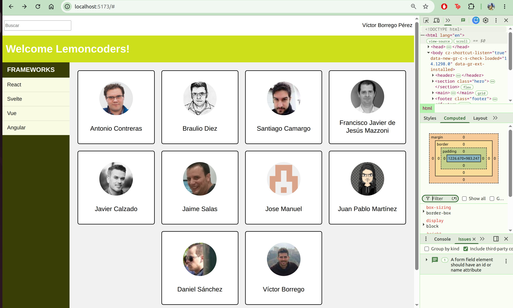
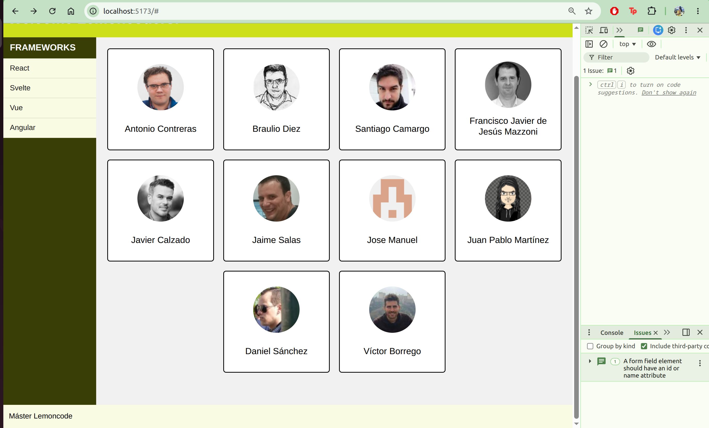

# LABORATORIO EXTRA

<p align="justify">
El objetivo de éste ejercicio era replicar la Home page dada, la cual contenía <em>un header, section, nav, main y footer</em> y teniendo presente lo anterior, ordenar la estructura acorde a las visuales y sus elementos teniendo en cuenta el diseño responsivo.
</p>

## TECNOLOGÍAS UTILIZADAS

El ejercicio está elaborado con vite+postcss. Así mismo, usé puglins de postcss necesarios para desarrollar el ejercicio.

### CARACTERÍSTICAS PRINCIPALES Y SOLUCIÓN AL EJERCICIO

<p align="justify"> 
Antes de empezar a trabajar en la visual, lo primero que hice fue maquetar la estructura de la página en <a href="./index.html">index.html<a>. La ordené por los siguientes layouts y sus elementos<em>header: el input de búsqueda y el nombre del usuario</em>, <em>section: el título de bienvenida</em>, <em>main: compuesto por el navbar y el contenedor de la lista de miembros</em>.Finalmente, <em>footer: donde finaliza la página, acompañado de un texto</em>.

Una vez organizado ésto, apliqué <em>flexbox</em> para header,navbar,footer y <em>CSS GRID</em> para el main y el contenedor. Decidí usar CSS GRID para el main y el contenedor teniendo en cuenta la organización del layout para el <em>navbar y main</em> y dada la ubicación de los elementos que contienen la lista de la clase <em>.team__list</em> consideré que lo mejor era usar GRID, ya que personalmente considero que, ubicar los <em>div's</em> #9 y #10 era sencillo a través de éste sistema y a su vez, me permitiría aplicar las media queries de manera sencilla.

Respecto al diseño responsivo, para poder alinear y fijar el elemento de la clase <em>.hero__nav<em> usé el estilo <em>fixed<em>. Con el tamaño mediano me apoyé de los event handlers del DOM y para diseños pequeños, con el estilo anterior e integrado con los demás estilos bastó.
</p>

### INFORMACIÓN EXTRA: ORGANIZACIÓN DE CARPETAS

Dado la clase de postcss decidí guiarme por ésa organización establecida.De manera que quedó ordenada de la siguiente manera:

```text
Extra/
├── src/
│   ├── css/
│   │   ├── base/
│   │   │   ├── media.css
│   │   │   └── variables.css
│   │   ├── layout/
│   │   │   ├── header.css
│   │   │   ├── section.css
│   │   │   ├── container.css
│   │   │   └── footer.css
│   │   ├── vendors/
│   │   │   └── reset.css
│   │   └── main.css
│   └── js/
│       └── nav-scroll.js
├── index.html
├── README.md
└── images/
```


### INSTALACIÓN Y CONFIGURACIÓN

<p align="justify">
Para poder visualizar el Ejercicio es necesario ejecutar el comando <em>"git clone git@github.com:vpalonsog/Master-Front-End-XX.git"</em>.Debes moverte a la carpeta <em>Layout</em>.Luego, moverse a la carpeta <em>Extra</em> y ahí, ejecutar los comandos <em>"npm i/npm install"<em> y <em>"npm run dev"</em>.
</p> 

### DEMOSTRACIÓN VISUAL






