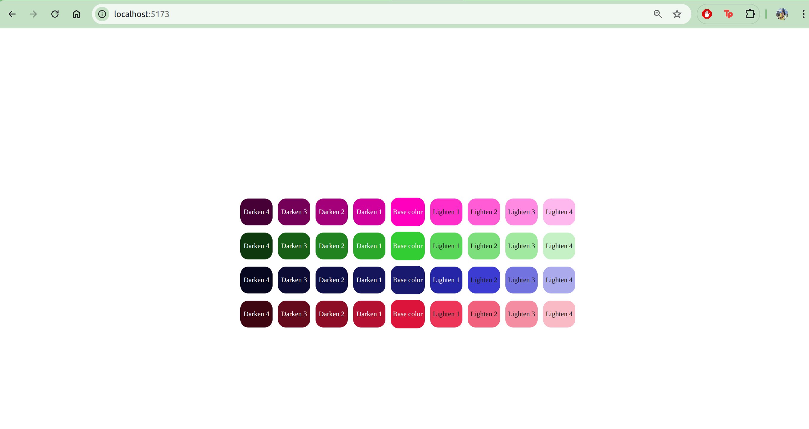

# EJERCICIO No. 1 DESARROLLADO CON PREPROCESADOR SASS

<p align="justify"> 
El objetivo de éste ejercicio era poder visualizar 4 tonos más oscuros y otros 4 más claros teniendo en cuenta un color base. Para efectos prácticos, era necesario establecer 4 colores base. Además, era necesario tener presente el color del texto base de las cajas para lograr contrastar con el color del background correspondiente.
</p>

## TECNOLOGÍAS UTILIZADAS

El ejercicio está elaborado con El Preprocesador Sass y Vite.

### CARACTERÍSTICAS PRINCIPALES Y SOLUCIÓN AL EJERCICIO

<p align="justify"> 
Dado el ejercicio, lo primero que se tuvo en cuenta fue cómo se debían nombrar las variables que se usaban repetidas veces. Entonces, se identificó que las variables globales eran los colores base y el texto de color base para las cajas, los cuales se encuentran en <a href="./_base.scss">_base.scss</a>. Una vez se establecieron las variables, pensé en la tarea a ejecutar, es decir, cómo podría generar los degradados en los colores teniendo presente que se debía ir aclarando de un lado (derecha) y del otro ir oscureciendo (izquierdo). Para eso, encontré que podía usar mixin y funciones. Entonces basado en sus 4 niveles sabía que éste sería el límite y que, debía empezar por el número 1 por ser primera vez. Dada ésa premisa y teniendo en cuenta que debía aplicar ésto más de 1 vez y para 4 contenedores distintos lo más adecuado era usar mixin, dado que iba a aplicar varias propiedades tal como background-color, border-color y color para el texto. Así mismo, dentro del scope del mixin que nombré como <em>tone-variants</em> agregué unas variables como light-bg y dark-bg con la función color.scale para así obtener las paletas de colores y evitar repetir código. Decidí usar un ciclo for para que fuera escalable para el resto.Entonces, como en el archivo <a href="./index.html">index.html</a> se establecieron para etiqueta div dentro de cada contenedor la clase lighten y darken, se podría reutilizar llamandolas dentro del for para automatizar su tarea de elementos restantes. Listo ésto, hacía falta el color del texto. Para ésto, me pareció preciso aplicar funciones. Así que lo nombré <em>tone-text-color</em> y establecí una condición dependiendo del color del background que el div tuviera en ése momento y lo aplicara conforme a su color base white. Ya teniendo ésto, lo agregué a las propiedades del mixin <em>tone_variants</em>,el cual esperaba como parámetro a incluir el color base <em>base-color</em> y la base del color del text <em>base-text-color</em>. Dada la serie de contenedores decidí nombrar otro mixin llamado <em>color-container</em> para que tuviera los estilos genéricos de cada contenedor y sus div's y que, sólo fuera necesario los parámetros de entrada (color base, color de texto base).
</p>

### INFORMACIÓN EXTRA DE ESTILOS Y PROPUESTAS

<p align="justify"> 
Me parece importante destacar que, agregué estilos basados en flexbox para centrar los contenedores desde el body y sus elementos divs de cada contenedor. Adicional a ésto, propongo que si no sabemos cuál será el número de contenedores para poder automatizar éstos estilos sería prudente convertir el número de contenedores a una variable de entrada usando mixin, llamada <em>steps</em>, y se podría seguir usando un for o un forEach y en vez de tener la función <em>tone-text-color</em>, simplemente se limitaría a no verbose el código y se colocara el cálculo arriba dentro del scope de mixin <em>tone-variants</em>. De tal manera que, se aplicaría de la siguiente manera: 
</p>

```scss
@mixin tone-variants($steps, $base-color, $base-text-color) {
  $levels: ();

  @for $i from 1 through $steps {
    $levels: list.append($levels, $i);
  }

  @each $i in $levels {
    $light-bg: color.scale($base-color, $lightness: 18% * $i);
    $dark-bg: color.scale($base-color, $lightness: -18% * $i);
    $light-text: if(
      color.channel($light-bg, "lightness", $space: hsl) > 50%,
      color.scale($base-text-color, $lightness: -90%),
      $base-text-color
    );

      color.channel($dark-bg, "lightness", $space: hsl) > 50%,
      color.scale($base-text-color, $lightness: -90%),
      $base-text-color

    .lighten-#{$i} {
      background-color: $light-bg;
      border-color: $light-bg;
      color: $light-text;
    }

    .darken-#{$i} {
      background-color: $dark-bg;
      border-color: $dark-bg;
      color: $dark-text;
    }
  }
}
```

### INSTALACIÓN Y CONFIGURACIÓN

<p align="justify">
Para poder visualizar el Ejercicio es necesario ejecutar el comando <em>"git clone git@github.com:vpalonsog/Master-Front-End-XX.git".</em>
</p> 

### DEMOSTRACIÓN VISUAL




